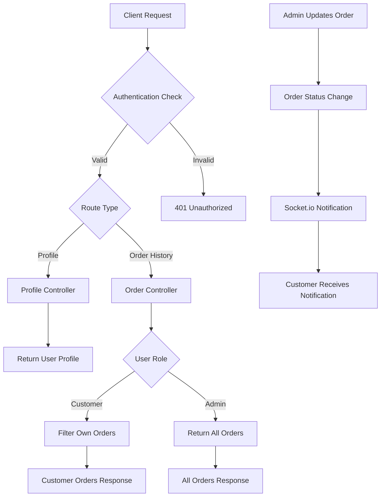

# Design Document

## Overview

This design extends the existing e-commerce API with user profile management, role-based order history access, and real-time shipping status notifications. The implementation leverages the existing authentication system, Order model, and socket.io infrastructure while adding new endpoints and notification capabilities.

## Architecture

### High-Level Components

1. **Profile Management**: New profile controller and routes for user profile access
2. **Order History Service**: Enhanced order controller with role-based filtering
3. **Real-time Notifications**: Socket.io integration for shipping status updates
4. **Authentication Integration**: Leverages existing JWT authentication and role-based access

### System Flow



## Components and Interfaces

### 1. Profile Controller (`src/controllers/profileController.js`)

**Purpose**: Handle user profile retrieval for authenticated users

**Methods**:

- `getProfile(req, res)`: Returns authenticated user's profile information

**Input**: JWT token in Authorization header
**Output**: User profile data (excluding password)

**Security**:

- Requires valid JWT authentication
- Returns only the authenticated user's own profile data

### 2. Enhanced Order Controller

**Purpose**: Extend existing order controller with role-based order history

**New Methods**:

- `getOrderHistory(req, res)`: Returns order history based on user role

**Role-based Logic**:

- **Customers**: Filter orders by `customerId` matching authenticated user's ID
- **Admins**: Return all orders without filtering

**Input**: JWT token in Authorization header
**Output**: Array of orders based on user role

### 3. Socket.io Notification Service

**Purpose**: Send real-time notifications when order shipping status changes

**Integration Points**:

- Existing `src/services/socketService.js`
- Order update operations in order controller

**Notification Flow**:

1. Admin updates order shipping status
2. System identifies the customer who owns the order
3. Socket.io emits notification to specific customer's socket connection
4. Customer receives real-time notification

**Notification Format**:

```javascript
{
  title: "New shipping status",
  message: "Your last order shipping status has been updated to <status>"
}
```

### 4. Route Definitions

**New Routes**:

- `GET /profile` - User profile retrieval
- `GET /order-history` - Role-based order history

**Authentication**: All routes require JWT authentication via existing auth middleware

## Data Models

### User Profile Response

```javascript
{
  success: true,
  message: "Profile retrieved successfully",
  data: {
    _id: "user_id",
    fullName: "User Name",
    email: "user@example.com",
    role: "customer|admin",
    createdAt: "timestamp",
    updatedAt: "timestamp"
  },
  statusCode: 200
}
```

### Order History Response

```javascript
{
  success: true,
  message: "Order history retrieved successfully",
  data: [
    {
      _id: "order_id",
      customerId: "customer_id",
      items: [...],
      totalAmount: 100.00,
      shippingStatus: "pending|shipped|delivered",
      orderNumber: "ORD-123456",
      createdAt: "timestamp",
      updatedAt: "timestamp"
    }
  ],
  statusCode: 200
}
```

### Socket.io Notification Structure

```javascript
{
  title: "New shipping status",
  message: "Your last order shipping status has been updated to delivered"
}
```

## Error Handling

### Authentication Errors

- **401 Unauthorized**: Invalid or missing JWT token
- **403 Forbidden**: Valid token but insufficient permissions (if applicable)

### Profile Endpoint Errors

- **401**: User not authenticated
- **500**: Server error retrieving profile

### Order History Endpoint Errors

- **401**: User not authenticated
- **500**: Server error retrieving orders

### Socket.io Error Handling

- **Graceful Degradation**: If socket.io fails, order updates continue successfully
- **Connection Handling**: Notifications only sent to connected clients
- **Error Logging**: Socket errors logged but don't affect order operations

## Testing Strategy

### Unit Tests

1. **Profile Controller Tests**

   - Test profile retrieval for authenticated users
   - Test error handling for unauthenticated requests
   - Verify password exclusion from response

2. **Order History Controller Tests**

   - Test customer role filtering (only own orders)
   - Test admin role access (all orders)
   - Test authentication requirements
   - Test empty order history scenarios

3. **Socket.io Service Tests**
   - Test notification emission for order updates
   - Test customer-specific targeting
   - Test graceful handling of disconnected clients

### Integration Tests

1. **Profile Endpoint Integration**

   - Test complete request/response cycle
   - Test with different user roles
   - Test authentication middleware integration

2. **Order History Endpoint Integration**

   - Test role-based filtering end-to-end
   - Test with multiple users and orders
   - Test pagination if implemented

3. **Real-time Notification Integration**
   - Test order update triggering notifications
   - Test multiple connected clients
   - Test notification format and content

### Security Testing

1. **Authentication Bypass Attempts**

   - Test endpoints without tokens
   - Test with invalid tokens
   - Test with expired tokens

2. **Authorization Testing**

   - Test customers accessing other customers' data
   - Test role escalation attempts

3. **Data Exposure Testing**
   - Verify password exclusion from profile responses
   - Test for sensitive data leakage in order history

## Implementation Considerations

### Performance

- **Database Indexing**: Leverage existing indexes on `customerId` and `createdAt` for order queries
- **Response Optimization**: Use lean queries for order history to reduce payload size
- **Socket.io Scaling**: Current implementation suitable for single-server deployment

### Security

- **JWT Validation**: Reuse existing authentication middleware
- **Role-based Access**: Implement proper role checking for order history
- **Data Sanitization**: Ensure no sensitive data exposure in responses

### Scalability

- **Socket.io Clustering**: May need Redis adapter for multi-server deployments
- **Database Queries**: Order history queries may need pagination for large datasets
- **Notification Queuing**: Consider message queuing for high-volume notifications

### Monitoring

- **Logging**: Integrate with existing logger utility
- **Error Tracking**: Use existing error handling patterns
- **Performance Metrics**: Monitor response times for new endpoints
